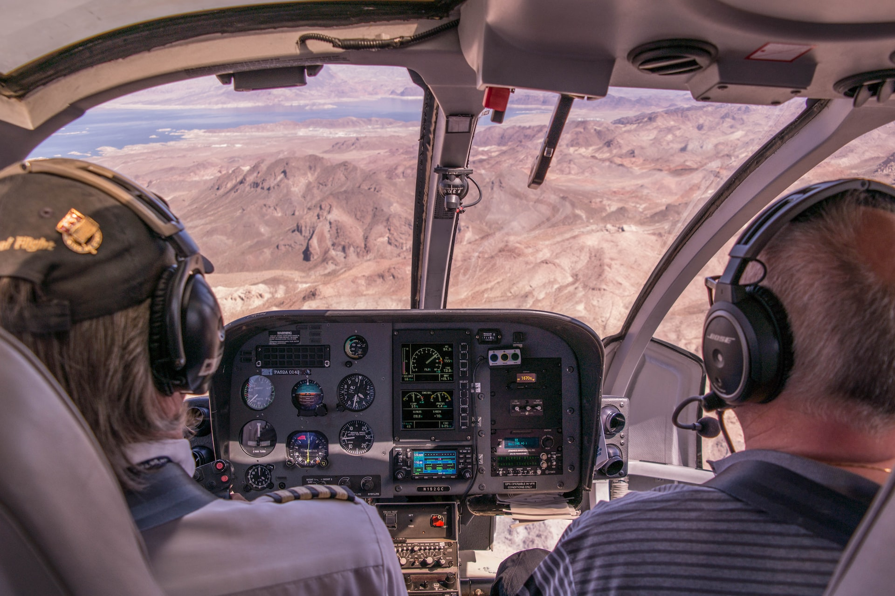

<!-- markdownlint-disable MD026 MD033 MD045 -->

<!-- Compile to HTML with `marp -w -s --html true .` -->

<!-- https://marpit.marp.app/markdown -->
<!-- https://mob.sh/ -->

 

## A presentation in which you are the hero

Gwendal Leclerc & Benoît Masson – OVHcloud

---

## Who are we ?

### Benoît

Team Lead Domains

### Gwendal

Tech Lead Domains

---

## What is mob programming?

A bit like peer programming, but with more than 2 people...

---

## How does it works?

1️⃣ ~~helicopter~~ computer

↙️ pilote &emsp;&emsp;&emsp; (copilote ↘️)

⬇️ the rest of the room ⬇️

---

## Rotations

The roles are changed every 5 to 10 minutes!

··· → room → copilote → pilote → room → ···

---

## Remotely?

- Shared IDE (LiveShare, …)
- Code sharing (git, …)

---

# [`mob.sh`](https://mob.sh)

An overlay on git to make code sharing easier

---

# Demo

---

# Behind the mob

---

# Benefits

<!--
- test
- test2
-->

---

# Drawbacks

<!--
- test
- test2
-->

---

# Thanks !

---

# Questions ?

Image credits: [unsplash.com](https://unsplash.com)
Slides: [github.com/gwleclerc/mob.sh](https://github.com/gwleclerc/mob.sh/)

